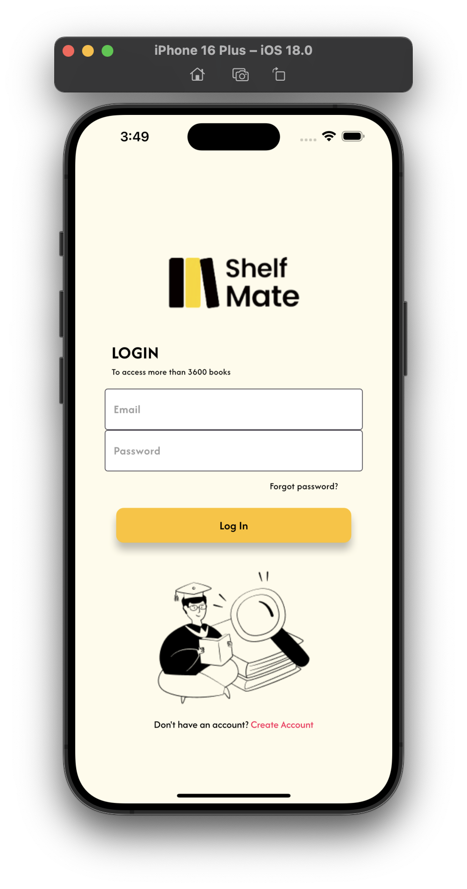

# INTERNATIONAL ISLAMIC UNIVERSITY MALAYSIA  
## KULLIYYAH OF INFORMATION COMMUNICATION TECHNOLOGY  
### CSCI 4311 | MOBILE APPLICATION DEVELOPMENT | SECTION 1  
### SEMESTER 1, 2024/2025  
## Virtual Library: ShelfMate  

### By Group: XBT  

---

## **Group Members**  

| Name                                   | Matric ID  |  
|----------------------------------------|------------|  
| **Nor Aiman Zaharin Bin Noor Azwan**   | 2115931    |  
| **Muhammad Zulhazmi Rafiqi Azhary**    | 2116207    |  
| **Muhammad Syafiy Bin Abdul Rahman**   | 2115569    |  

---

## **Project Summary**  

**Virtual Library: ShelfMate** is a mobile application designed to provide users with an interactive and accessible XXX

---

## **Project Objectives**  

1. **Efficient Use of Widgets**  
   - Utilize Flutter’s widget-based architecture to create modular, reusable, and scalable UI components (e.g., book cards, navigation bars, buttons).  

2. **Integration of HTTP Library for Data Fetching**  
   - Implement the HTTP package to fetch book data, images, and other relevant information from an external API, ensuring real-time updates.  <link> https://developers.google.com/books/docs/overview </link>

3. **Authentication System with Firebase/API**  
   - Set up Firebase Authentication or an API-driven authentication system to manage user sign-ups, logins, and account security.  

4. **Proper Page Routing and Navigation**  
   - Implement structured navigation using Flutter’s `Navigator` system for smooth transitions between pages (home, book details, user profile, etc.).  

5. **Responsive and Well-Designed Layouts**  
   - Use Flutter’s layout widgets (`Column`, `Row`, `Expanded`, `Flexible`, `Stack`) to ensure proper UI alignment, responsiveness, and a seamless user experience across different screen sizes.  

---

## **Compilation and Running Instructions**

XXX

---

## **Snapshots of the Application Running, and Explantion of the Flow of the App**

The **Virtual Library: ShelfMate** app follows a structured and user-friendly flow to ensure smooth navigation and accessibility. Below is the step-by-step flow of the app:

1. Splash Screen → Authentication Page

- When the user launches the app, they are greeted with a **Splash Screen** displaying the app logo.  
- After a brief delay, the app navigates to the **Authentication Page**, where users can:  
  - **Sign Up** for a new account.  
  - **Log In** using Firebase Authentication or an API-based authentication system.  

2. Home Page  
- After logging in, users are directed to the **Home Page**, which serves as the main dashboard.  
- The Home Page includes:  
  - **Search Bar** – Allows users to search for books by title or keyword.  
  - **Navigation Bar** – Provides access to different sections of the app (Home, Books, Favourites, Profile).

3. Book Details Page  
- When a user selects a book from the Home Page, they are directed to the **Book Details Page**.  
- This page displays:  
  - **Book Cover Image**  
  - **Book Title & Author**  
  - **Description/Synopsis**  
  - **Star Rating & User Reviews**  
  - **“Preview” Button** – XXX.
  - **Favorite Button** – Allows users to save books to their personal collection.  

4. Books Page
- This page consists of the books that are available.....

5. Favourites Page (Saved Books)  
- This page contains books that the user has:  
  - **Added to Favorites** for quick access.
- Users can remove books (unfavourite) if needed.  

6. Profile Page  
- Users can access their **Profile Page** to:  
  - XXX
  - XXX
  - XXX 

7. 🔄 Overall Navigation Structure  
